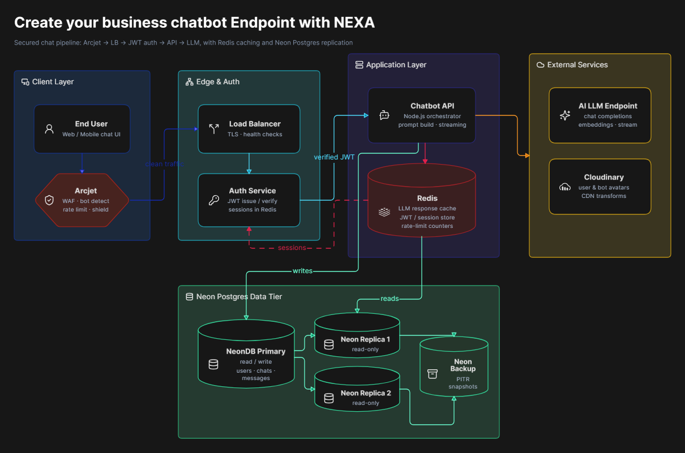

<p align="center">
  
</p>

<h1 align="center">NEXA — AI Chatbot API</h1>

<p align="center">
  A production-grade, multi-tenant chatbot REST API built with <b>NestJS</b>.
  Every business can create a chatbot, teach it "characteristics", and let its customers talk to it over sessions — rendered with ease for any frontend.
</p>

<p align="center">
  <a href="https://nestjs.com"></a>
  
  
  
  
  
  
</p>

---

## About

**NEXA** is a **multi-tenant AI chatbot API**. Organizations invite members, build chatbots backed by the **OpenRouter** free AI model, and enrich each bot with _characteristics_ (data + restrictions). End-customers then open a **session** and chat — the API injects the business profile, characteristics, and prior chat history into the AI prompt for accurate, on-brand answers.

Use it to power customer-support bots, FAQ assistants, or sales agents for **any product or business** — an API-ready brain for your frontend, website widget, or mobile app.

<p align="center">
  <a href="https://nestjs.com"></a>
  
  
  
  
  
  
  
</p>
<p align="center">
  
  
  
  
  
  
  
</p>

---

## Tech Stack

| Category           | Technologies                                                      |
| ------------------ | ----------------------------------------------------------------- |
| Runtime & Language | Node.js 22, TypeScript 5                                          |
| Framework          | NestJS 11, @nestjs/config, @nestjs/cls, @nestjs/schedule          |
| Database           | PostgreSQL (NeonDB — main / replica / backup), node-postgres (pg) |
| Cache & Queue      | Redis (ioredis) — GET caching + token blacklist + refresh tokens  |
| Auth               | Passport-JWT, @nestjs/jwt, bcrypt, OTP password reset             |
| AI                 | OpenRouter (free chat-completions model)                          |
| Storage            | Cloudinary                                                        |
| Email              | EmailJS                                                           |
| Security           | Arcjet (bot defense, shield, rate limiting)                       |
| Validation         | class-validator, class-transformer                                |
| Documentation      | @nestjs/swagger (OpenAPI)                                         |
| Process & Scale    | node:cluster (5 workers), PM2, graceful shutdown                  |
| Observability      | Winston / nest-winston                                            |
| Scheduling         | @nestjs/schedule (backup-sync cron)                               |
| Testing            | Jest, ts-jest, Supertest                                          |
| CI / Deploy        | GitHub Actions (lint, test:unit), Docker, docker-compose          |

---

## Industry Standard Practices

- **Modular monolith** — clean, decoupled feature modules (auth, organization, chatbot, characteristic, session, chat, master, health).
- **DTO validation** with class-validator + global `ValidationPipe`.
- **Proper HTTP status codes** and consistent, professional error messages via a global exception filter.
- **Redis cache-aside** with adaptive invalidation on writes (`redisHit` flag in responses).
- **JWT access/refresh** flow with token blacklisting; **bcrypt** password hashing.
- **Role-based rules** (owner / admin / member) for organization operations.
- **Multi-stage Docker** image with runtime-only env injection (no secrets baked in).
- **Graceful shutdown** and process supervision (cluster + PM2).
- **GitHub Actions CI** for lint and unit tests.
- **Unit & E2E testing** — Jest unit tests across every module (with mocks) plus real HTTP E2E suites via Supertest.
- **Swagger API documentation** — every route documented and grouped, auto-served at `/api` with a bearer-auth scheme.
- **JWT + Redis token strategy** — stateless JWTs keep no session in server memory; Redis stores refresh tokens and blacklists revoked ones, so memory stays flat even at scale.
- **Load balancing & workers integration** — multiple `node:cluster` workers share the port behind the OS load balancer, supervised by PM2 with automatic restarts.
- **Multi-database system** — dual-write to **main + replica**, read replication for throughput, and a **backup** database refreshed by a sync cron.
- **Cache stampede awareness** — a bounded 60s TTL with adaptive write-invalidation limits redundant origin hits and keeps stale windows short and reads fresh.

---

## System Design

<p align="center">
  
</p>

**Flow** — A user → JWT → organization → members create chatbots → characteristics are attached → a customer calls `POST /session/:chatbotId` to create/resume a session → `POST /chat/:sessionId` sends the message → the API assembles the AI prompt (bot + characteristics + history) → OpenRouter replies → the paired chat is persisted in Redis-cached PostgreSQL.

**Database** — Tables: `users`, `organizations`, `members`, `chatbots`, `characteristics`, `sessions`, `chats`, with cascading foreign keys and an auto-`updated_at` trigger.

**Read / Write Splitting** — All writes (`INSERT`/`UPDATE`/`DELETE`) are issued to both the **main** and the **duplicate (replica)** databases in parallel (dual-write), keeping them always in sync. Fast reads go to the **duplicate** for throughput, while critical consistency reads hit the **main** directly. This cleanly separates the source of truth from the read-heavy load.

**Backup Sync Cron** — A scheduled job (`BackupSyncCron`) periodically mirrors the **main** database into a dedicated **backup** database inside a single transaction. It truncates and re-inserts every table in correct foreign-key order, so the backup always reflects the latest clean state and stays restorable.

**Security** — Arcjet (bot + rate-limit + shield), JWT guards, role gates, encrypted customer emails (`pgcrypto`), OTP expiry, and no secrets in source or images.

---

## Security

**NEXA protects every layer** — from the network edge to the database.

- **Arcjet** — a global guard that shields the API with:
  - **Shield** — catches suspicious / malicious request patterns.
  - **Bot detection** — blocks automated traffic.
  - **Rate limiting** — a fixed-window limit per IP to prevent abuse.
  - Configured via `ARCJET_KEY` and `ARCJET_MODE` (`LIVE` or `DRY_RUN`). If no `ARCJET_KEY` is set, protection is bypassed with a warning (safe for local dev).

- **AuthN / AuthZ** — JWT access + refresh tokens, token blacklisting, `bcrypt` password hashing, and role gates (`owner` / `admin` / `member`) for organization actions.

- **Data protection** — customer emails are encrypted with `pgcrypto` (`pgp_sym_encrypt`) before storage, and password-reset OTPs expire after **15 minutes**.

- **No secret leaks** — environment values are only injected at runtime (`.env` / Docker `env_file`); nothing is committed or baked into images.

```bash
# .env
ARCJET_KEY=your_arcjet_key
ARCJET_MODE=DRY_RUN   # or LIVE in production
```

---

## OpenRouter AI

**OpenRouter** powers the chatbot intelligence with a free chat-completions model — no heavy ML setup needed.

- On every `POST /chat/:sessionId`, the API:
  1. Loads the chatbot's `system_prompt` and its **characteristics** (`data` + `restrict`),
  2. Pulls the customer's **previous chat history** for that session,
  3. Assembles a strict system prompt and sends it with the new `customer_chat` to OpenRouter,
  4. Persists the paired `customer_chat` + `ai_chat` only after a successful reply.

- The AI is instructed to answer only from the provided characteristics, refuse unrelated questions politely, and **always return JSON**: `{"reply": "..."}` so the frontend can render it cleanly.

```bash
# .env
OPENROUTER_API_KEY=your_openrouter_key
APP_URL=http://localhost:3000
```

```typescript
// Free model used (configurable in src/openrouter/openrouter.service.ts)
const OPENROUTER_MODEL = 'openrouter/free';
```

---

## NeonDB

**NeonDB** is the cloud-hosted PostgreSQL backbone — serverless, auto-scaling, and fully managed.

- NEXA keeps **three Neon databases**: `main`, `duplicate` (replica), and `backup`.
- **Dual-write** sends every write to `main` + `duplicate`; reads prefer the `duplicate`, and the **backup** is refreshed by the scheduled sync cron.
- The `pg` client connects per operation with SSL, so it works cleanly in local, Docker, and serverless environments.

```bash
# .env
NEONDB_MAIN_URL=postgresql://...@ap-southeast-1.aws.neon.tech/main?sslmode=require
NEONDB_DUPLICATE_URL=postgresql://...@ap-southeast-1.aws.neon.tech/duplicate?sslmode=require
NEONDB_BACKUP_URL=postgresql://...@ap-southeast-1.aws.neon.tech/backup?sslmode=require
```

---

## Cloudinary

**Cloudinary** handles all image uploads and delivery (user avatars, organization banners, and chatbot images).

- Images are uploaded and their **`secure_url`** is stored in the database.
- When an image is replaced or its record deleted, the old asset is removed from Cloudinary too.
- **Cloudinary-first rule** — the DB is only updated after a successful upload; if the upload fails, no data is mutated.
- Assets live under the `NEXA_nestjs` folder.

```bash
# .env
CLOUDINARY_CLOUD_NAME=your_cloud_name
CLOUDINARY_API_KEY=your_api_key
CLOUDINARY_API_SECRET=your_api_secret
```

---

## Getting Started

```bash
# 1. Install dependencies
npm install

# 2. Configure environment
cp env_example .env   # then fill in the values (see env_example)

# 3. Run (make sure your redis running in the designated port, see env_example)
npm run start:dev     # watch mode
```

**Verify it's alive:**

- Root: `http://localhost:3000/`
- Health: `http://localhost:3000/health`
- Swagger UI: `http://localhost:3000/api`
- OpenAPI JSON: `http://localhost:3000/api-json`

> Every environment variable is documented in [`env_example`](./env_example). No secrets are committed.

---

## Main Routes

| Area           | Base Path         | Notes                                                              |
| -------------- | ----------------- | ------------------------------------------------------------------ |
| Health         | `GET /health`     | System health for every dependency                                 |
| Auth           | `/auth`           | register, login, logout, refresh, me, password-otp, password-reset |
| User           | `/user`           | profile update                                                     |
| Organization   | `/organization`   | org, members, roles, invite, transfer-ownership                    |
| Chatbot        | `/chatbot`        | create / update / delete / list                                    |
| Characteristic | `/characteristic` | data + restrict traits of a chatbot                                |
| Session        | `/session`        | create / resume / remove customer sessions                         |
| Chat           | `/chat`           | send message to AI, manage chat history                            |
| Master         | `/master`         | admin operations (master key)                                      |

A ready-to-import **Postman collection (`postman.json`)** with all routes and environment variables is included at the project root.

---

## Docker

```bash
# Build & run (api + redis)
docker compose up -d --build

docker compose ps                 # api should be healthy
curl http://localhost:3000/health
```

Container config: multi-stage image, runtime-only `.env` injection, automatic `npm ci` + build, and a `/health` healthcheck.

---

## Scripts

```bash
npm run lint        # ESLint + Prettier
npm run build       # compile NestJS
npm run start:dev   # watch mode
npm run start:prod  # run the compiled app
npm run start:pm2   # PM2 production
npm run test:unit   # Jest unit tests
npm run test:e2e    # Jest e2e tests (needs a running server)
```

---

Built with 🧡 by **Richky Abednego**.
